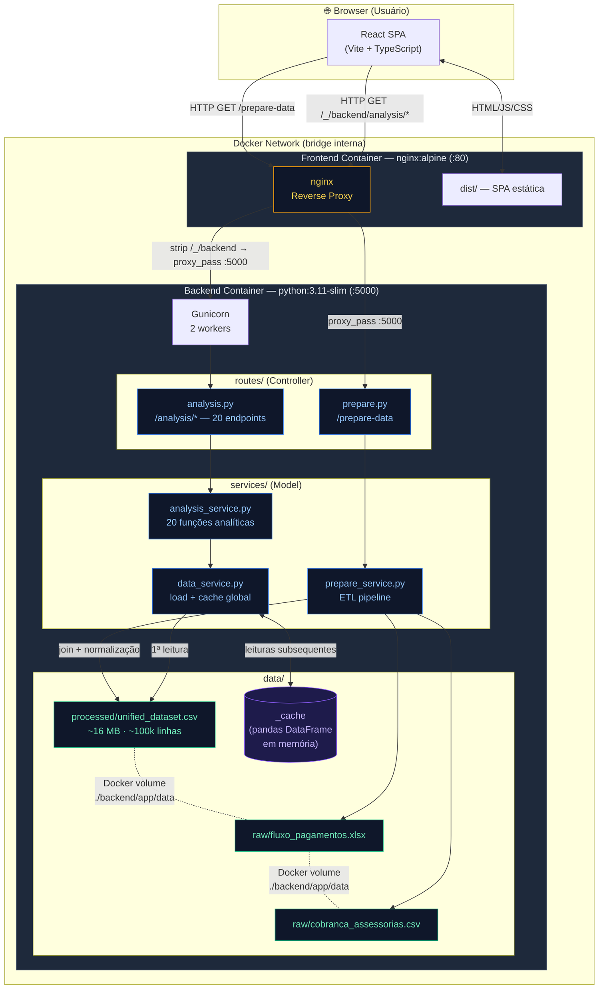

# Arquitetura do Sistema — CreditGuard

**Versão:** 1.0 | **Data:** 2026-06-03

---

## Diagrama de Arquitetura



---

## Visão Geral

CreditGuard é uma plataforma analítica de inadimplência e recuperação de crédito composta por três camadas: **frontend SPA**, **backend API REST** e **camada de dados CSV**. A infraestrutura é conteinerizada via Docker Compose.

```
┌──────────────────────────────────────────────────────────────────┐
│                        USUÁRIO (Browser)                         │
└─────────────────────────────┬────────────────────────────────────┘
                              │ HTTP :80
┌─────────────────────────────▼────────────────────────────────────┐
│                    FRONTEND CONTAINER                            │
│          nginx:alpine — Reverse Proxy + Static Files             │
│                                                                  │
│  /              → dist/ (React SPA)                              │
│  /_/backend/*   → proxy → backend:5000                           │
│  /prepare-data  → proxy → backend:5000                           │
└─────────────────────────────┬────────────────────────────────────┘
                              │ HTTP (rede interna Docker)
┌─────────────────────────────▼────────────────────────────────────┐
│                    BACKEND CONTAINER                             │
│         python:3.11-slim — Flask + Gunicorn (2 workers)          │
│                                                                  │
│  routes/                                                         │
│    ├── prepare.py    → GET /prepare-data                         │
│    └── analysis.py   → GET /analysis/*  (20 endpoints)           │
│                                                                  │
│  services/                                                       │
│    ├── prepare_service.py   (pipeline ETL)                       │
│    ├── data_service.py      (load + cache em memória)            │
│    └── analysis_service.py  (20 funções analíticas)              │
│                                                                  │
│  data/                                                           │
│    ├── raw/   fluxo_pagamentos.xlsx + cobranca_assessorias.csv   │
│    └── processed/ unified_dataset.csv (~16 MB, ~100k linhas)     │
└──────────────────────────────────────────────────────────────────┘
```

---

## Padrões de Arquitetura de Software

### Frontend — Component-Based Architecture (padrão React)

Arquitetura padrão do React: a UI é decomposta em componentes independentes e reutilizáveis, organizados por responsabilidade. Não há um Controller ou ViewModel separado — cada componente encapsula sua própria lógica de apresentação e estado local via hooks.

```
pages/      → componentes de rota (orquestram dados e layout de cada módulo)
components/ → componentes reutilizáveis de UI (gráficos, cards, tabelas)
services/   → camada de acesso a dados (chamadas HTTP isoladas em api.ts)
types/      → contratos de dados (interfaces TypeScript)
contexts/   → estado global compartilhado (tema dark/light)
```

Nenhum componente chama axios diretamente — toda comunicação com a API passa por `services/api.ts`, mantendo o isolamento entre UI e I/O.

### Backend — MVC (Model-View-Controller)

O backend segue o padrão MVC adaptado para API REST, onde a View é substituída pela resposta JSON:

| Camada MVC | Implementação | Responsabilidade |
|---|---|---|
| **Controller** | `routes/analysis.py`, `routes/prepare.py` | Recebe requisição HTTP, delega ao service, retorna JSON |
| **Model** | `services/analysis_service.py`, `services/prepare_service.py` | Lógica de negócio, cálculos e transformações |
| **View** | Resposta JSON (`jsonify`) | Representação dos dados para o cliente |

`data_service.py` atua como camada de acesso a dados (Repository), servindo o Model com o DataFrame em cache.

```
routes/     (Controller) → recebe HTTP, delega, serializa JSON
services/   (Model)      → lógica de negócio e cálculos analíticos
data/       (dados)      → CSV como fonte de dados persistida
```

---

## Camadas

### 1. Frontend

| Item | Valor |
|---|---|
| Framework | React 19 + TypeScript |
| Arquitetura | Component-Based (padrão React) |
| Build | Vite |
| Estilo | Tailwind CSS 4.x |
| Gráficos | Recharts 3.x |
| HTTP Client | axios |
| Servidor de produção | nginx:alpine |

Organização de código:

```
src/
  pages/          ← 7 módulos do dashboard (1 por rota)
  components/     ← componentes de visualização reutilizáveis
  services/api.ts ← todas as chamadas HTTP centralizadas
  types/api.ts    ← tipagem TypeScript dos contratos da API
  contexts/       ← ThemeContext (dark/light mode)
```

### 2. Backend

| Item | Valor |
|---|---|
| Framework | Flask 3.x |
| Arquitetura | MVC (Model-View-Controller) |
| Servidor WSGI | Gunicorn (2 workers) |
| Runtime | Python 3.11 |
| Processamento | pandas + numpy |
| Regressão | numpy.polyfit (OLS) |
| CORS | flask-cors |

Organização de código:

```
app/
  __init__.py          ← factory create_app(), registra blueprints, habilita CORS
  routes/              ← Controller: recebe HTTP e delega aos services
    prepare.py         ← blueprint prepare_bp (/prepare-data)
    analysis.py        ← blueprint analysis_bp (/analysis/*)
  services/            ← Model: lógica de negócio e acesso a dados
    prepare_service.py ← ETL: leitura, normalização, join, exportação
    data_service.py    ← singleton com cache global (_cache)
    analysis_service.py← 20 funções de análise
  data/
    raw/               ← fontes brutas (volume persistido via Docker volume)
    processed/         ← CSV unificado gerado pelo ETL
```

### 3. Camada de Dados

O sistema não usa banco relacional. Dados trafegam em arquivos:

| Arquivo | Tipo | Papel |
|---|---|---|
| `data/raw/fluxo_pagamentos.xlsx` | Excel | Fonte primária — parcelas e pagamentos |
| `data/raw/cobranca_assessorias.csv` | CSV | Fonte secundária — contratos em cobrança |
| `data/processed/unified_dataset.csv` | CSV | Dataset consolidado pós-ETL (~16 MB) |

Em runtime, o dataset processado é lido uma única vez e mantido em `_cache` (variável global em `data_service.py`), eliminando I/O em disco nas chamadas subsequentes.

---

## Infraestrutura Docker

```yaml
# docker-compose.yml (resumido)
services:
  backend:
    build: ./backend          # python:3.11-slim, porta 5000
    volumes:
      - ./backend/app/data:/app/app/data   # persiste raw + processed

  frontend:
    build: ./frontend         # nginx:alpine, porta 80
    ports:
      - "80:80"
    depends_on:
      - backend
```

- **Frontend expõe porta 80** ao host. Backend não tem porta exposta ao host — acessível apenas via proxy nginx.
- Volume monta `data/` no backend para que o CSV processado sobreviva reinicios de container.

---

## Roteamento nginx

```nginx
location /_/backend/ {
    rewrite ^/_/backend/(.*)$ /$1 break;
    proxy_pass http://backend:5000;
}

location /prepare-data {
    proxy_pass http://backend:5000;
}
```

O frontend envia todas as chamadas à API para `/_/backend/analysis/*`. O nginx faz strip do prefixo e encaminha para o backend interno.

---

## Padrão de Cache

```python
# data_service.py
_cache = None

def load_data() -> pd.DataFrame:
    global _cache
    if _cache is not None:
        return _cache
    df = pd.read_csv(PROCESSED_PATH)
    # ... parse de datas e tipos
    _cache = df
    return df
```

- Cada worker Gunicorn mantém sua própria cópia em memória (~16 MB por worker).
- Cache invalidado apenas com reinício do processo.
- `/prepare-data` regenera o CSV mas não invalida o cache — requer reinício manual para reload.
