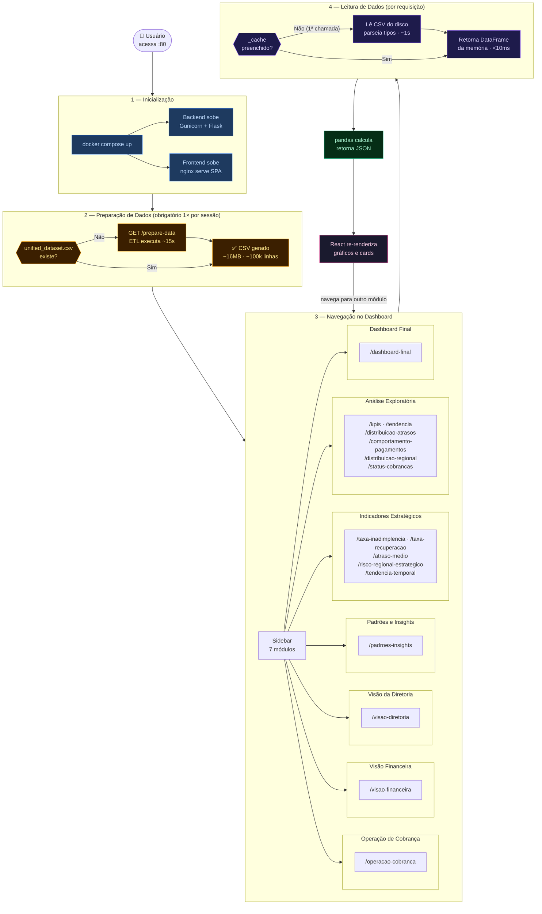

# Fluxo do Sistema — CreditGuard

**Versão:** 1.0 | **Data:** 2026-06-03

---

## Diagrama de Fluxo de Uso



---

## Fluxo Completo de Inicialização

```
1. docker compose up
        │
        ├── backend container inicia (Gunicorn, 2 workers)
        │       └── Flask app factory: registra blueprints + CORS
        │
        └── frontend container inicia (nginx)
                └── serve SPA + configura proxy reverso

2. Usuário acessa http://localhost:80
        │
        └── nginx serve index.html → React inicializa no browser

3. [OBRIGATÓRIO antes de qualquer análise]
   Usuário aciona GET /prepare-data
        │
        └── ETL pipeline executa (até 15s)
                └── unified_dataset.csv gerado em data/processed/
```

---

## Fluxo ETL — `/prepare-data`

```
GET /prepare-data
        │
        └── prepare_service.prepare_dataset()
                │
                ├── pd.read_excel("data/raw/fluxo_pagamentos.xlsx")
                │       ├── normalize_columns()      → lowercase, snake_case
                │       ├── drop_duplicates()
                │       ├── parse dates              → data_vencimento, data_pagamento
                │       ├── to_numeric               → valor_parcela, valor_pago
                │       └── feature engineering:
                │               dias_atraso      = (data_pagamento - data_vencimento).days
                │               pagamento_em_dia = dias_atraso <= 0
                │               percentual_pago  = valor_pago / valor_parcela
                │
                ├── pd.read_csv("data/raw/cobranca_assessorias.csv")
                │       ├── normalize_columns()
                │       ├── drop_duplicates()
                │       ├── parse dates              → data_envio_assessoria
                │       ├── normalize_region()       → Norte/Nordeste/Sudeste/Sul/Centro-Oeste
                │       ├── convert_currency()       → valor_inadimplente_inicial (BRL → float)
                │       └── fillna score_interno_risco com mediana
                │
                ├── LEFT JOIN on id_contrato
                │       └── pagamentos ← cobrança (registros sem cobrança mantidos)
                │
                ├── fillna("") → campos sem match preenchidos com string vazia
                │
                └── to_csv("data/processed/unified_dataset.csv")
                        └── retorna: { message, rows, columns, output }
```

---

## Fluxo de Consulta Analítica

```
Usuário navega para módulo X no dashboard
        │
        └── React component monta → useEffect dispara fetch
                │
                └── services/api.ts → axios GET /_/backend/analysis/<endpoint>
                        │
                        └── nginx recebe, strip "/_/backend" → proxy para backend:5000
                                │
                                └── Flask route → analysis_service.<função>()
                                        │
                                        └── data_service.load_data()
                                                │
                                                ├── _cache != None? → retorna DataFrame
                                                └── _cache == None? → lê CSV, preenche cache, retorna
                                        │
                                        └── pandas compute → dict → jsonify → HTTP 200 JSON
                                                │
                                                └── axios → React state update → re-render
```

---

## Fluxo por Módulo do Dashboard

| Módulo | Endpoint(s) chamados ao montar |
|---|---|
| 01 — Análise Exploratória | `/kpis`, `/tendencia`, `/distribuicao-atrasos`, `/comportamento-pagamentos`, `/distribuicao-regional`, `/status-cobrancas` |
| 02 — Indicadores Estratégicos | `/taxa-inadimplencia`, `/taxa-recuperacao`, `/atraso-medio`, `/risco-regional-estrategico`, `/tendencia-temporal` |
| 03 — Padrões e Insights | `/padroes-insights` |
| 04 — Visão da Diretoria | `/visao-diretoria` |
| 05 — Visão Financeira | `/visao-financeira` |
| 06 — Operação de Cobrança | `/operacao-cobranca` |
| 07 — Dashboard Final | `/dashboard-final` |

---

## Fluxo de Tratamento de Erros

```
Erro no backend (qualquer endpoint analítico)
        │
        ├── exceção Python → HTTP 500 + { error: "<mensagem>" }
        │       └── caminhos internos de arquivo NÃO expostos na resposta
        │
        └── axios recebe 5xx
                └── React exibe mensagem de erro amigável por seção
                        └── outros módulos não são afetados (fetches independentes)

CSV não encontrado ao chamar load_data()
        └── FileNotFoundError → HTTP 500
                └── mensagem orienta usuário a executar /prepare-data primeiro
```

---

## Sequência de Estados do Dataset

```
Estado 1: Apenas raw data existe
  data/raw/fluxo_pagamentos.xlsx     ✓
  data/raw/cobranca_assessorias.csv  ✓
  data/processed/unified_dataset.csv ✗
  → endpoints analíticos retornam HTTP 500

Estado 2: ETL executado com sucesso
  data/processed/unified_dataset.csv ✓
  _cache = None                      (ainda não lido)
  → primeiro endpoint analítico chamado → CSV lido → _cache preenchido

Estado 3: Cache aquecido
  _cache = DataFrame (~16 MB por worker)
  → todas as chamadas analíticas respondem em < 3s
```
